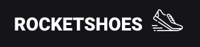

<h1 align="center">
    
</h1>
<p align="center">🚀 Project made during the React Ignite, it is a marketplace where you can buy nice shoes</p>

## See how it works 📸


<h4 align="center"> 
	Project Fizalized 🎉
</h4>

## Features

- You can select from the home page what shoes do you want and it will go to your card.
- There is a limit in stock for its product, an error message will display depending on your amount.
- On the card page you can add more or decrement it.
- If you don't want this product anymore just delete it, clicking in the trash icon.
- The total of your purchase and the total of its items will be displayed on the screen. 
- This project has the localStorage feature go check it.

## Technologies 👩‍💻

The following tools were used in this project:

- [React](https://pt-br.reactjs.org/)
- [TypeScript](https://www.typescriptlang.org/)
- [Json-Server](https://www.npmjs.com/package/json-server)
- [Axios](https://github.com/axios/axios)
- [toastify](https://github.com/fkhadra/react-toastify#readme)
- [Styled-Components](https://styled-components.com/)

## Requirements

Before starting 🏁, you need to have [Git](https://git-scm.com) and [Node](https://nodejs.org/en/) installed.

## Starting 🚀

```bash
# Clone this project
$ git clone https://github.com/Artur-Ceschin/Ignite-React-03.git

# Access
$ cd Ignite-React-03

# Install dependencies
$ yarn

# Run the server on port localhost:3333
$ yarn server

# Run the project
$ yarn start

# Run the Tests
$ yarn test

# The server will initialize in the <http://localhost:3000>
```
## License📃

This project is under license from MIT. For more details, see the [LICENSE](./LICENSE.md) file.

### Autor
---

Made with ❤️ by Artur Ceschin 👋🏽 Entre em contato!
<br/>
[](https://www.linkedin.com/in/artur-peres-ceschin-programador/) 
[](mailto:artur.ceschin@gmail.com)